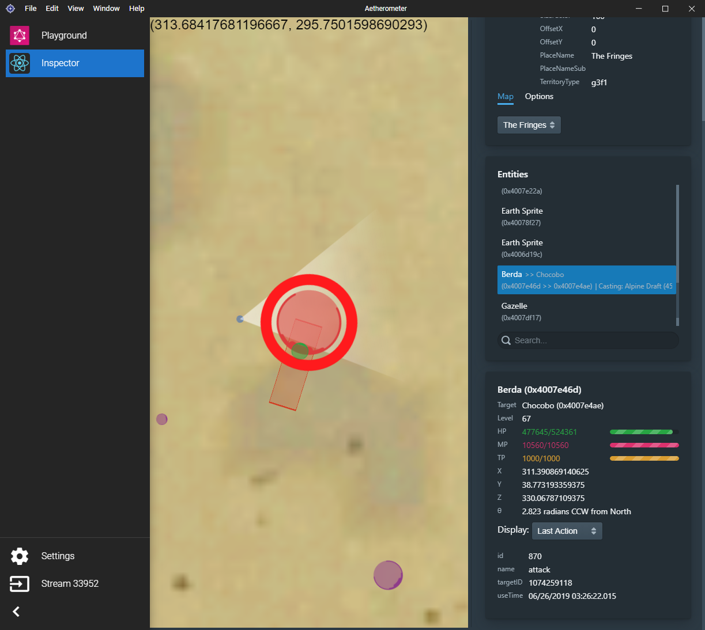

# Inspector

Inspector is a plugin leverages Aetherometer's network data parsing
capabilities to live-inspect the state of your surroundings in FFXIV.
Using this tool is as simple as [adding it to Aetherometer](#installation).

## Features

- Displays all entities nearby and their relative sizes and locations on a map.
- There is a toggleable option to allow the map to follow your character's movements.
- Displays all casted area-of-effect abilities as colored telegraphs, including those casted by allies.
- You can search for a nearby entity by name.
- Live displays most spawn and combat attributes for all entities including
  status effects, attack names, and cast names.
- Interactive map allows you to pan, zoom in/out, or select an entity.

## What Inspector does not do

Since Aetherometer does not rely on reading any memory to learn about the
world prior, you need to rezone once in the beginning when starting
Aetherometer in order to see a fully accurate state of the world in
Inspector.

Currently, there isn't way to look back at the history of events, but an
aspiring developer can leverage the same technology Inspector does to record
a sequence of events.

## Installation

1. Go to Settings in Aetherometer
2. Check the streams (or process IDs) that you would like to inspect.
3. Fill in:
    - Plugin Name: Inspector
    - Plugin URL: https://ff14wed.github.io/inspector-plugin/
4. Click Add Plugin
5. You should now be able to navigate to Inspector and start using it.

## For Developers

This project was bootstrapped with [Create React App](https://github.com/facebook/create-react-app).

When testing you can add http://localhost:3000 as the plugin URL to
Aetherometer and hit Ctrl+Shift+J to open a developer console.

### Available Scripts

In the project directory, you can run:

### `npm start`

Runs the app in the development mode. 
Open [http://localhost:3000](http://localhost:3000) to view it in the browser.

The page will reload if you make edits. 
You will also see any lint errors in the console.

### `npm test`

Launches the test runner in the interactive watch mode. 
See the section about [running tests](https://facebook.github.io/create-react-app/docs/running-tests) for more information.

### `npm run build`

Builds the app for production to the `build` folder. 
It correctly bundles React in production mode and optimizes the build for the best performance.

The build is minified and the filenames include the hashes. 
Your app is ready to be deployed!

See the section about [deployment](https://facebook.github.io/create-react-app/docs/deployment) for more information.
